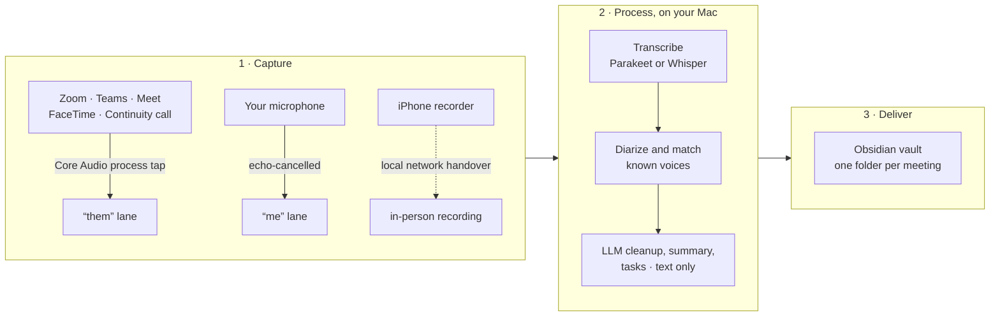

<p align="center">
  
</p>

<p align="center">
  <a href="https://github.com/NicolaiSchmid/steno/releases"></a>
  <a href="https://github.com/NicolaiSchmid/steno/actions/workflows/swift-ci.yml"></a>
  <a href="https://github.com/NicolaiSchmid/steno/actions/workflows/mobile-ci.yml"></a>
  
  
</p>

<p align="center">
  <b>Steno records your meetings without joining them, turns the recording into a summary,
  transcript and tasks on your own Mac, and writes the result into your Obsidian vault.</b><br>
  No bot in the call. No cloud account. No subscription. Audio never leaves the machine.
</p>

<p align="center">
  <a href="#install">Install</a> ·
  <a href="#how-it-works">How it works</a> ·
  <a href="#what-lands-in-your-vault">What you get</a> ·
  <a href="#features">Features</a> ·
  <a href="#privacy">Privacy</a> ·
  <a href="#phone-companion">Phone companion</a> ·
  <a href="#for-developers">Developers</a>
</p>

> **Status: release candidate.** v1 is code-complete and shipping as pre-releases while
> the last manual checks on real hardware run. Track the first stable release in
> [issue #74](https://github.com/NicolaiSchmid/steno/issues/74). The full scope and every
> settled decision live in [`.plans/2026-09-24-initial-scope.md`](.plans/2026-09-24-initial-scope.md).

## Why Steno

Most meeting recorders join your call as a participant, upload the audio to their servers
and keep your notes behind their login. Steno takes the opposite route:

| | Hosted bot recorders | Steno |
|---|---|---|
| **Captures audio by** | A bot joins the meeting | Core Audio taps the apps already playing on your Mac |
| **Everyone on the call sees** | "Notetaker has joined" | Nothing |
| **Audio is processed** | In the vendor's cloud | On your Mac, after the meeting |
| **Notes live in** | The vendor's app | Plain files in your Obsidian vault |
| **Works for** | Supported video platforms | Zoom, Teams, Meet, FaceTime, Slack, phone calls via Continuity, in-person meetings |
| **Cost** | Monthly subscription | Free, open source, your own LLM endpoint |

It was built to match the day-to-day quality of commercial meeting recorders for one
person and their friends, with files instead of lock-in.

## Install

Steno is a signed and notarized `Steno.app` for macOS 15 or later on Apple Silicon.
Pick one of the three routes; all three install the same release build.

**Homebrew** (recommended, keeps itself updated through Sparkle)

```sh
brew tap nicolaischmid/tap && brew install --cask steno
```

**Direct download**

Grab `Steno-<version>.dmg` from the
[latest release](https://github.com/NicolaiSchmid/steno/releases/latest) and drag the app
to `/Applications`.

**Nix** (`aarch64-darwin`, installs the released app unchanged)

```sh
nix profile install github:NicolaiSchmid/steno#steno
```

On first launch Steno walks you through the three permissions it needs: system audio
capture, microphone, and optionally calendar access for meeting titles and attendee
names. Then point it at your Obsidian vault and an OpenAI-compatible endpoint, and you are
done.

<details>
<summary><b>Homebrew details: tap, release candidates, nix-darwin</b></summary>
<br>

The tap ([NicolaiSchmid/homebrew-tap](https://github.com/NicolaiSchmid/homebrew-tap))
follows every release, release candidates included. The installed app updates itself
through Sparkle, which offers stable releases only. With nix-darwin's Homebrew module:

```nix
homebrew.taps = [ "nicolaischmid/tap" ];
homebrew.casks = [ "nicolaischmid/tap/steno" ];
```

</details>

<details>
<summary><b>Nix details: nix-darwin, home-manager, updates</b></summary>
<br>

`flake.nix` installs the released `Steno.app` unchanged (no rebuild, no re-signing) on
`aarch64-darwin`.

With nix-darwin, add the flake as an input and put `steno.packages.aarch64-darwin.steno`
in `environment.systemPackages`; nix-darwin links `Applications/Steno.app` into
`/Applications/Nix Apps`. With home-manager use `home.packages` and link the app yourself
(`home.file` into `~/Applications`, or the `mac-app-util` module); home-manager does not
link `Applications/` on its own. `nix run` does not apply, the output is an app bundle
with no `bin/`.

The app runs from the read-only Nix store, so Sparkle's "Check for Updates…" can download
a new version but cannot install it. Update by bumping `release.version` and
`release.hash` at the top of `flake.nix` (the release workflow prints both in its job
summary) and rebuilding. To silence the scheduled daily check:

```sh
defaults write uno.schmid.steno.mac SUEnableAutomaticChecks -bool NO
```

nix-darwin users who want in-app updates can use the Homebrew cask through
`homebrew.casks` instead; it installs into `/Applications`, where Sparkle can write.

</details>

## How it works



1. **Capture.** When another app opens your microphone, a small prompt asks whether to
   record. Say yes, or start and stop from the menu bar at any time. The other side of
   the call comes from a Core Audio process tap, your side from the mic, kept as two
   separate lanes so Steno always knows who is "me" and who is "them".
2. **Process.** After the meeting, the recording is transcribed on-device with
   Parakeet TDT v3 or WhisperKit large-v3-turbo, diarized, and matched against the
   voices Steno has heard before. Only the resulting transcript text goes to the LLM
   endpoint you configured, which fixes the Denglish, writes the summary from a template
   and extracts tasks with assignee, priority and due date.
3. **Deliver.** The finished meeting is pushed into your vault as Markdown, VTT and JSON.
   Re-export at any time; Steno overwrites only the files it wrote.

## What lands in your vault

One dated folder per meeting, named after the title. The folder note is what Obsidian
opens when you click the folder.

```
Meetings/
└── 2026-09-24-produktstrategie-90-10-roadmap-fuer-q4/
    ├── 2026-09-24-produktstrategie-90-10-roadmap-fuer-q4.md              # summary, decisions, scratchpad
    ├── 2026-09-24-produktstrategie-90-10-roadmap-fuer-q4 - Transcript.md
    ├── 2026-09-24-produktstrategie-90-10-roadmap-fuer-q4 - Tasks.md      # Obsidian Tasks syntax
    ├── transcript.vtt
    ├── meeting.json
    └── audio.m4a                                                         # opt-in per meeting
```

The folder note carries queryable frontmatter and links to the people who were there:

```markdown
---
title: "Produktstrategie: \"90/10\" & Roadmap für Q4"
date: 2026-09-24T14:00:00
duration: 90
participants:
  - "[[Anna Müller]]"
  - "Jérôme Dupont"
  - "[[Nicolai Schmid]]"
tags:
  - "meeting"
  - "Kunde-ACME"
source: "mac-call"
template: "default"
language: "de"
---

# Produktstrategie: "90/10" & Roadmap für Q4

2026-09-24 14:00–15:30 · 1 h 30 min · Mac call · [[… - Transcript|Transcript]] · [[… - Tasks|Tasks]]

## Summary

### Executive Summary

- **Fokus**: **Anna Müller** setzt 90 Prozent auf den Kern und 10 auf Experimente.

## Decisions

- 90/10-Aufteilung wird umgesetzt.
```

Tasks come out ready for the Obsidian Tasks plugin, so they show up in your existing
queries next to everything else:

```markdown
- [ ] Angebot an ACME schicken [[Anna Müller]] ⏫ 📅 2026-10-01
- [ ] Roadmap-Folien aktualisieren [[Nicolai Schmid]] 📅 2026-10-15
```

Summaries follow one of four built-in templates: **Default**, **Customer Discovery**,
**Daily Standup** and **Interview**. Pick a different one after the fact and re-run the
summary without touching the transcript.

## Features

<table>
<tr>
<td width="50%" valign="top">

**Records without a bot**<br>
Core Audio process taps for the other side, your mic for you. Nobody in the call sees a
notetaker, and it works for anything that plays audio on your Mac, including phone calls
taken via Continuity and in-person meetings.

</td>
<td width="50%" valign="top">

**Everything on your Mac**<br>
Transcription, diarization and speaker matching run on-device. The only network traffic
Steno generates is transcript text to the LLM endpoint you chose.

</td>
</tr>
<tr>
<td valign="top">

**Remembers voices**<br>
Name a speaker once and Steno recognises them next time. Unknown speakers get a
ten-second clip to listen to, plus name suggestions from the conversation and the
calendar invite.

</td>
<td valign="top">

**German, English and Denglish**<br>
Language is detected per meeting, and an LLM cleanup pass fixes the code-switching,
casing and product names every speech model gets wrong.

</td>
</tr>
<tr>
<td valign="top">

**Knows when a meeting starts**<br>
A prompt appears when another app opens the microphone. Calendar titles and attendees
are filled in from EventKit, no Google Calendar API involved.

</td>
<td valign="top">

**Files, not lock-in**<br>
Markdown, VTT and JSON per meeting. Optional per-person pages linking their meetings.
Read, search and automate in your vault with whatever tools and agents you already use.

</td>
</tr>
<tr>
<td valign="top">

**You decide what to keep**<br>
Audio retention is a setting: delete right after processing, keep for N days, or keep
forever, with a per-meeting override.

</td>
<td valign="top">

**Bring your own model**<br>
Any OpenAI-compatible endpoint works for post-processing, from a hosted API to a model
running on the same Mac. Base URL and API key, nothing else.

</td>
</tr>
</table>

## Privacy

| Data | Where it goes |
|---|---|
| Meeting audio | Stays on your Mac, in a folder you choose. Deleted per your retention setting. |
| Transcript text | Sent to the LLM endpoint **you** configure, and only there. |
| Speaker voice embeddings | Stored in the local SQLite database. Never uploaded. |
| Summary, tasks, notes | Written to your vault. The app never runs git or syncs anything itself. |
| Phone recordings | Travel from your iPhone to your Mac over the local network only, TLS with pinned keys. |

There is no Steno server. Disk encryption is FileVault's job.

## Phone companion

For meetings away from the Mac there is a deliberately dumb iOS recorder in
[`mobile/`](mobile/). It records, keeps a local queue, and hands the files to your paired
Mac over the local network when both are on the same Wi-Fi. Pairing is a one-time QR
scan; transport is HTTPS with pinned certificates. Processing happens on the Mac with the
same pipeline as any in-person recording. The phone holds no notes and needs no account.

## What Steno does not do

Steno is scoped on purpose. It does not run on Windows, Linux or Intel Macs. There is no
live transcript during the call, no chat over your meetings, no editing of generated text
inside the app, no team features, no hosted service and no App Store build. The app is
the source of truth for your data; reading, searching and automation happen in your vault.

## For developers

Swift 6 and SwiftUI on macOS 15+, SQLite via [GRDB](https://github.com/groue/GRDB.swift),
[FluidAudio](https://github.com/FluidInference/FluidAudio) and
[WhisperKit](https://github.com/argmaxinc/WhisperKit) for speech, SpeexDSP for echo
cancellation, SwiftNIO for the phone handover, Sparkle for updates. The iOS recorder is an
Expo dev-client app.

```
AGENTS.md           conventions for coding agents (CLAUDE.md links here)
Package.swift       Swift package: StenoCore, StenoAudio, StenoSpeech, StenoLLM,
                    StenoAdapters, StenoHandover and the `steno` CLI
apps/macos/         SwiftUI app over the package, xcodegen project, own README
mobile/             Expo iOS recorder, own pnpm project, own README
.plans/             scope and dated implementation plans
docs/research/      teardown of commercial recorders and the open-source landscape
.github/workflows/  repository, Swift and mobile CI; macOS release on `v*` tags
```

```sh
swift build && swift test                 # the package; Apple-only modules need macOS
swift run steno record --help             # record from the CLI
swift run steno dev models list           # speech and diarization model assets
swift run steno dev bakeoff --help        # compare speech engines over a folder
```

Building the app: [`apps/macos/README.md`](apps/macos/README.md). The phone side:
[`mobile/README.md`](mobile/README.md). Conventions, review priorities and the plan
workflow: [`AGENTS.md`](AGENTS.md). Everything that is not UI lives in the package, so
the CLI, the macOS app and any future surface share one implementation.

## Background

Steno started as an open-source alternative to commercial meeting recorders. Along the
way it borrows ideas from [anarlog](https://github.com/fastrepl/anarlog),
[Parrot](https://github.com/turantekin/Parrot) and
[AudioCap](https://github.com/insidegui/AudioCap), all rebuilt rather than forked. The
name is a nod to stenographers and is known to collide with a few commercial products;
that is acceptable for a personal open-source project.

## License

MIT.
